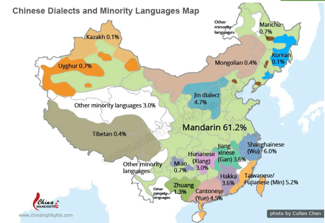
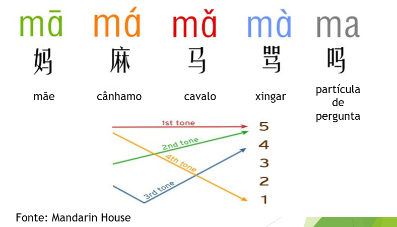

# Mandarim

<!--  -->

Anotações e resumos de aulas de mandarim do módulo Básico I do [Instituto Confúcio](https://www.institutoconfucio.com.br/), da Unesp. 

Professora: 熊紫薇。

### **Básico 1**

- Fonética. Pronuncia. Pinyin. Teclado chinês.
- Hanzi. Ler e escrever caracter chinês.
- Auto-apresentação (nome, nacionalidade, trabalho, estudo...)
- Cumprimentar
- Números, idades, família
- Cultura chinesa e atualidades.

Resumo do conteúdo:

- Lição 0 - Introdução de pronúncia e escrita (3 aulas)
- Lição 1 - Nacionalidade, idiomas, nome (3-4 aulas)
- Lição 2 - Estudo, trabalho (4 aulas)
- Lição 3 - Família, descrição (3-4 aulas)

- [📚 Resumo das aulas - 课程总结](#resumo-das-aulas)
- [💬 Vocabulário - 词汇](#vocabulario)
- [🔗 Links - 链接](#links)

---

## Resumo das aulas

### **Aula 1**

📕 _Parte 1: Apresentação_

Olá！ 你好！

Me chamo David. E você? 我叫大卫。你呢？

Eu sou brasileiro. 我是巴西人。

Eu amo a China. Eu amo o Brasil. 我爱中国。 我爱巴西。

Eu te amo! 我爱你！

📕 _Parte 2: Sobre a china_

China 中国

Apresentação do mapa da China e cidades.

📕 _Parte 3: Sobre a língua Chinesa_

Mandarim como lingua mais falada na China

Chinês (língua) 汉语

Características da língua Chinesa:
- Verbos não são conjulgados
- Existem 4 tons para as sílabas

- Existem os caracteres tradicionais, simplificados e o pinyin (pronunciação).

### **Aula 2** - 

### **Aula 3** -
### **Aula 4** -
### **Aula 5** -
### **Aula 6** -
### **Aula 7** -
### **Aula 8** -
### **Aula 9** -
### **Aula 10** -
 

---

## Vocabulario

- 

---

## Links

- [Programa do curso](./basico1.pdf)
- [Hanzi5](https://www.hanzi5.com/) (como desenhar hanzis corretamente)
- [Pixton](https://app.pixton.com/#/join?classCode=j35vvy) (foto da turma)
- [Flipgrid](https://flipgrid.com/66aa32f2) (vídeos divertidos)
- [Quizlet](https://quizlet.com/br/520252300/licao-1-flash-cards/)
- [Pleco](https://www.pleco.com/) (Dicionário de chinês)
- [Hanzi -> Pinyin](https://www.an2.net/zim/index_en.php)
- [Arch Chinese](https://www.archchinese.com/)
- [Adicionar teclado chines no mac](./TecladoChinesMac.pdf)
- [Adicionar teclado chines no windows e android](./TecladoChinesWindowsAndroid.pdf)
- [Instalar Pinyin Tones](./PinyinTonesTutorial.pdf)
- [Caderno de Hanzi](./CadernodeHanzi.pdf)