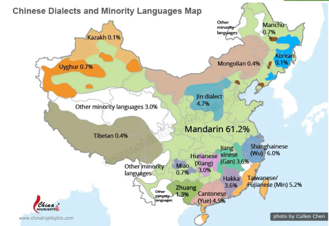
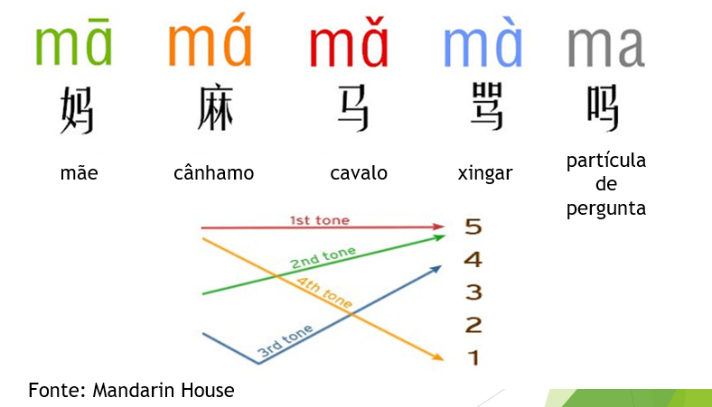

# Aula 1

📕 _Parte 1: Apresentação_

Olá！ 你好！

Me chamo David. E você? 我叫大卫。你呢？

Eu sou brasileiro. 我是巴西人。

Eu amo a China. Eu amo o Brasil. 我爱中国。 我爱巴西。

Eu te amo! 我爱你！

 

---

 

📕 _Parte 2: Sobre a china_

China 中国

Apresentação do mapa da China e cidades.

 

---

 

📕 _Parte 3: Sobre a língua Chinesa_

Mandarim como lingua mais falada na China

Chinês (língua) 汉语

Características da língua Chinesa:
- Verbos não são conjulgados
- Existem 4 tons para as sílabas

- Existem os caracteres tradicionais, simplificados e o pinyin (pronunciação).

