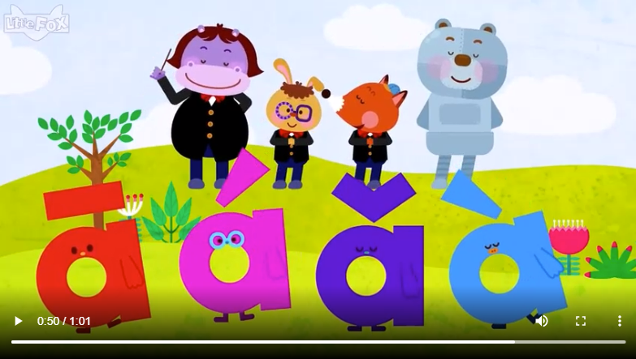
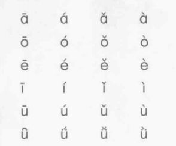

# Aula 2

📕 _Parte 1: Revisão 复习_

- lâoshī: 老师
- Bãxī: 巴西
- kãfēi: 咖啡
- Zhõngguó: 中国
- Bãxī rén: 巴西人
- nî hâo: 你好
- xiâo gôu: 小狗
- chá: 茶
- xièxiè: 谢谢
- wô ài nî: 我爱你
- Zhõngwén: / Hànyû 中文 / 汉语
- xiâo mão: 小猫

**Agradecimento**:

Obrigado!  Xiè xiè! 谢谢！

De nada! Bú kèqi!  不客气！

**Desculpas**:

Desculpa!  Duìbuqî! 对不起！

Por nada! Méi Guãnxi!  没关系！

 

---

 

📕 _Parte 2: Pronúncias de chinês_

Ni  -> Pinyin (soletrar som)
你  -> Caractere, ideograma, Hanzi (escrita chinesa)

**Funções do pinyin**

- Aprender a pronúncia
- Aprender vocabulário novo
- Inserção de caracteres em computadores e celulares
- Grafar os nomes chineses em publicações estrangeiras

**Tons**

- ā ē ī ō ū ǖ Ā Ē Ī Ō Ū Ǖ

- á é í ó ú ǘ Á É Í Ó Ú Ǘ

- ǎ ě ǐ ǒ ǔ ǚ Ǎ Ě Ǐ Ǒ Ǔ Ǚ

- à è ì ò ù ǜ À È Ì Ò Ù Ǜ

- a e i o u ü A E I O U Ü

